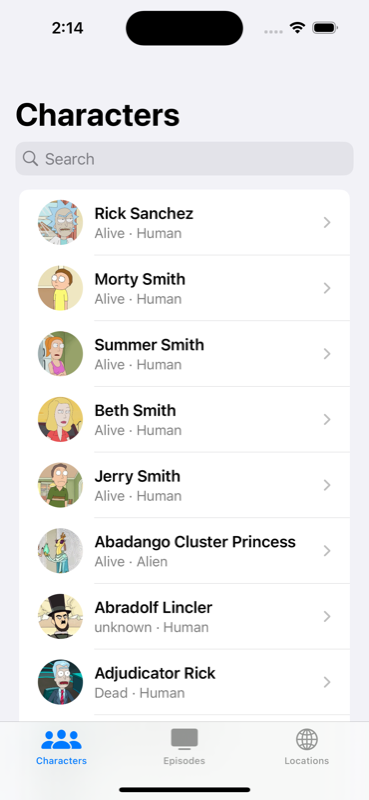
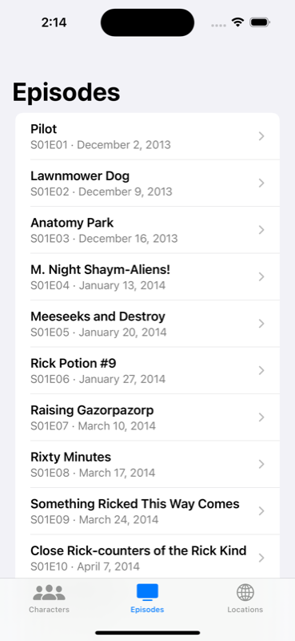
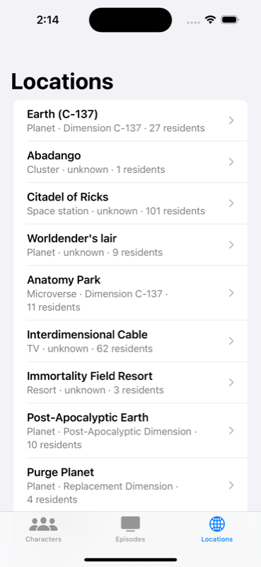

# Rick and Morty example

A modular SwiftUI app for the public [Rick and Morty GraphQL API](https://rickandmortyapi.com/graphql),
built with Bazel, rules_apollo (Apollo iOS 2.4), rules_apple and rules_xcodeproj.

| Characters | Episodes | Locations |
|---|---|---|
|  |  |  |

## Layout

```
graphql/                     schema.graphqls (introspected), schema types, shared test mocks
Networking/                  the ApolloClient
Features/Characters/         *.graphql, Sources/ (SwiftUI), Tests/
Features/Episodes/           spreads the CharacterCard fragment owned by Characters
Features/Locations/          spreads CharacterCard too
App/                         the ios_application with three tabs
```

Every feature package has the same targets:

| Target | What it is |
|---|---|
| `<Feature>GraphQL` | A Swift module with only that feature's generated queries and fragments (`apollo_swift_operations`) |
| `<Feature>Feature` | The feature's screens and view models (`swift_library`) |
| `<Feature>TestSupport` | Test mocks only this feature references (`apollo_swift_test_mocks`) |
| `<Feature>Tests` | Unit tests on the iOS simulator. They build query results from mocks; no network |

`CharacterCard` is defined once, in `Features/Characters/CharacterCard.graphql`. Episodes and Locations
spread it, list `//Features/Characters:CharactersGraphQL` in `deps`, and reuse the Characters row view
and detail screen.

## Build, test, run

```sh
bazel test //...                        # codegen, all modules, simulator unit tests, mock partition test
bazel build //App:RickAndMorty          # the .ipa
bazel run //App:RickAndMorty            # build, boot a simulator, install and launch
```

The app talks to the live API. Launch arguments `-tab episodes` and `-tab locations` open the other tabs,
which is how the screenshots above were taken.

## Xcode

```sh
bazel run //:xcodeproj                  # writes RickAndMorty.xcodeproj
xed RickAndMorty.xcodeproj
```

Pick the `RickAndMorty` scheme and an iPhone simulator, then Run (⌘R). Pick a `<Feature>Tests` scheme and
Test (⌘U). Xcode builds through Bazel, so codegen runs as part of the build: edit a `.graphql` file, build,
and the new fields are available in Swift.

Generated code shows up in the project as `<target>_apollo_*_N.swift` files. Each packs several generated
files, with a `// rules_apollo: <original path>` line marking where each one starts. Jump to definition on
a generated type (e.g. `CharacterCard`) lands in the shard that contains it.

Rerun `bazel run //:xcodeproj` after adding targets or packages. Edits to existing `.graphql` and `.swift`
files don't need it.

## Test mocks

`bazel run //graphql:mock_partition_test_update` assigns each mock type to the base module or to a
feature. For this schema every type ends up in the base `RickAndMortyAPIMocks`, and the feature
`TestSupport` modules are empty. Every type is reached from the shared `Query` mock, so no feature can
own one (see [MOCKS.md](../../docs/MOCKS.md#7-limits-and-open-questions)).

## Updating the schema

```sh
graphql/update_schema.sh                # introspects the live API into graphql/schema.graphqls
```
