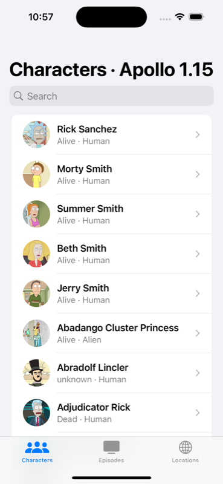
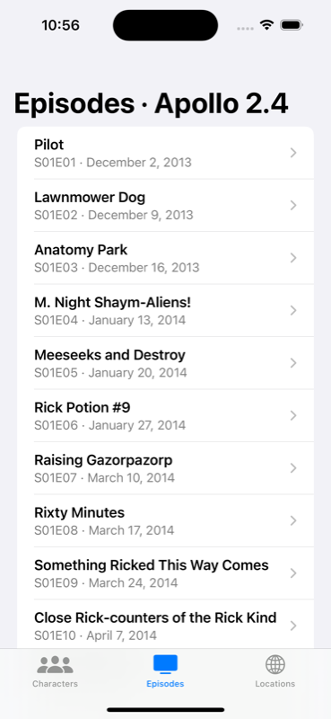

# Rick and Morty: a migration in progress

The [Rick and Morty example](../rick_and_morty) halfway through moving from Apollo iOS 1.15.2 to 2.4.0.
Both versions are in one app:

| Characters · Apollo 1.15 | Episodes · Apollo 2.4 |
|---|---|
|  |  |

How it works and the rules to follow are in [docs/MIGRATIONS.md](../../docs/MIGRATIONS.md).

## Layout

| Module | Runtime | Notes |
|---|---|---|
| `//graphql:RickAndMortyAPI` / `RickAndMortyAPI_v2` | both | Schema types, one framework per runtime |
| `//graphql:RickAndMortyAPIMocks` / `_v2` | both | Test mocks per runtime |
| `//Networking` / `Networking_v2` | both | One source file; `#if APOLLO_IOS_2` where the client APIs differ |
| `//Features/CharacterUI` | none | `CharacterSummary` and the row view: what the two runtimes share |
| `//Features/Characters:CharactersFeature` | 1.15.2 | Owns the `CharacterCard` fragment and the detail screen |
| `//Features/Locations:LocationsFeature` | 1.15.2 | Spreads `CharacterCard` |
| `//Features/Episodes:EpisodesGraphQL` | **2.4.0** | Raw `apollo_operations` + your own `swift_library`. Home runtime 2.4.0, so no suffix |
| `//Features/Episodes:EpisodesFeature` | **2.4.0** | Spreads `CharacterCard` through `CharactersGraphQL_v2` |
| `//App:RickAndMorty` | none | Composes the screens; sets how character details open |

`MODULE.bazel` declares the runtimes. There is no `third_party` BUILD file for Apollo iOS: rules_apollo
builds both versions.

## Try it

```sh
bazel test //...                  # codegen for both runtimes, the app, unit tests on the simulator
bazel test //UITests              # live API: Episodes (2.4) → character detail (1.15)
bazel run //App:RickAndMorty      # launch in a simulator
bazel run //:xcodeproj && xed RickAndMortyMigration.xcodeproj
```

To migrate another feature, e.g. Locations, change `runtime = "current"` to `"next"` on
`LocationsFeature` and `LocationsTestsLib` in `Features/Locations/BUILD.bazel`, then fix what 2.4.0
changed in its code: `page: .some(Int32(page))` instead of `.some(page)`, and `await` on
`LocationsQuery.Data.from(...)` in the test.

Characters and Locations use the macros (`apollo_swift_operations`). Episodes uses the rules directly: its
codegen target's `.swift` output goes into a plain `swift_library`. Both styles are in the same app.

## Checking it in Xcode

The generated project has a scheme for every module of both runtimes (`ApolloAPI` and `ApolloAPI_v2`,
`CharactersGraphQL` and `CharactersGraphQL_v2`, …). Built and tested with `xcodebuild`. Worth checking by hand:

- In `Features/Episodes/Sources/EpisodesScreen.swift`, jump to definition on `EpisodesQuery`
  (`EpisodesGraphQL`, home runtime 2.4.0), on `CharacterCard` (`CharactersGraphQL_v2`) and on
  `.some(…)` (`GraphQLNullable` in `ApolloAPI_v2`, through the only alias). All three should land in
  the 2.4.0 sources.
- In `Features/Characters/Sources/CharactersScreen.swift` the same symbols should land in 1.15.2.
- Autocomplete and inline errors in both files.
- Breakpoints in both features while the app runs.
